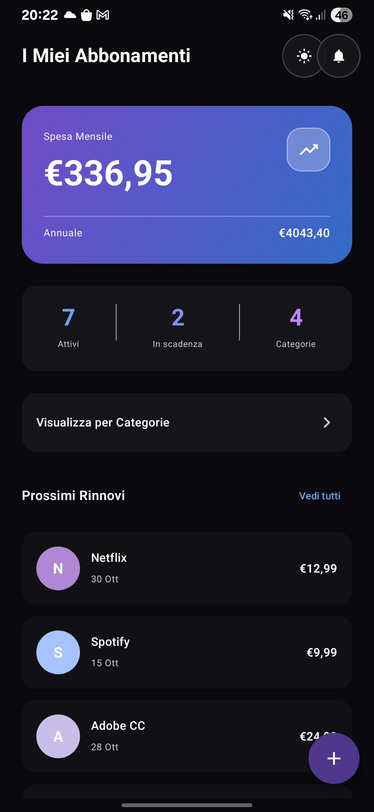
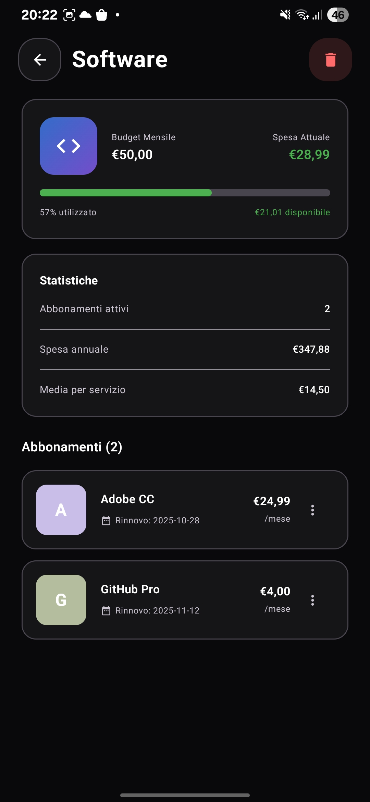
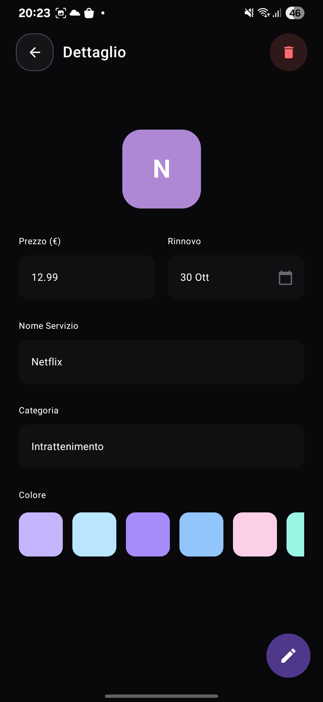
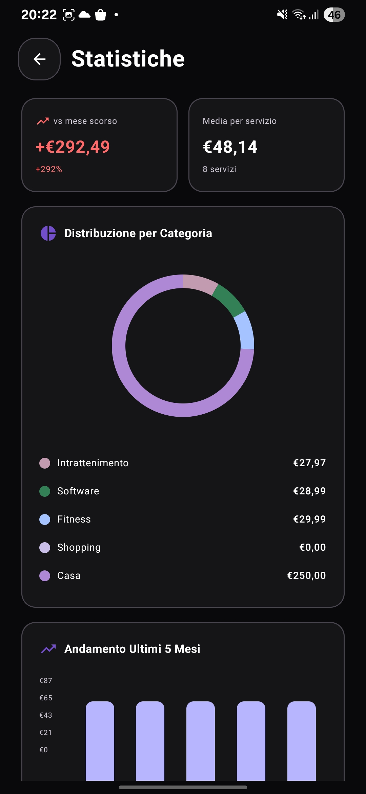
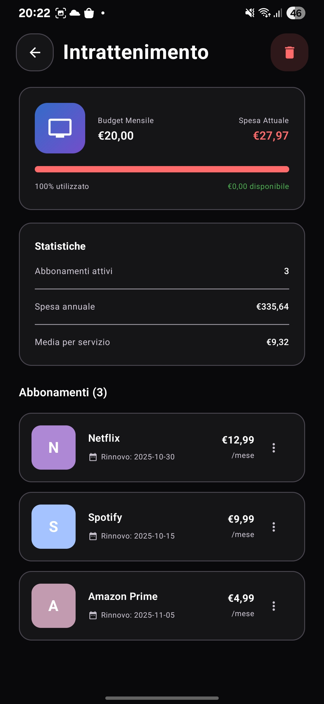

# SubManager
  
_A simple and modern mobile app to track your monthly expenses, focus on subscriptions.. Still work-in-progress._

## Features

Lista delle Funzioni principali:
  - Mockup in figma
  - Uso di Dati biometrici e autenticazione con Firebase
  - 🌙 Impostazioni con toggle tema
  - Pagina con una lista di item (sub o category)
  - ✅ Aggiunta di nuovi elementi
  - Pagina di dettaglio item
  - 📊 Grafici e data visualization
  - Persistenza dati su database, DataStore e preferences
  - Funzionalità di ricerca e filtri
  - Notifiche push per i rinnovi
  - Intent per aprire l'app dalla notifica

  
  
  
  
  

## Todo
 - Autenticazione
 - Andamento ultimi 5 mesi
 - statisticche finali (abbonamento e categoria più costoso) + potenziale risparmio 
 - Abbonamenti in scadenza
 - Insight prendi colori per categoria
